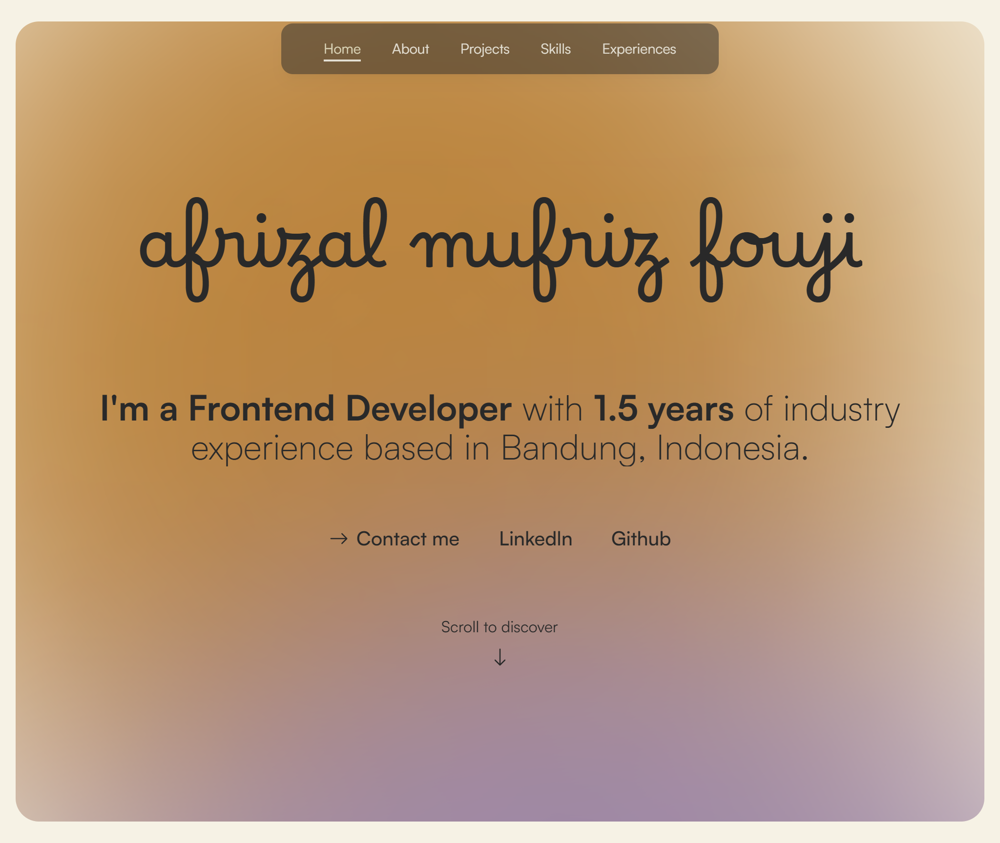

# Modern Portfolio Template

A sleek, responsive portfolio template built with Next.js, TypeScript, Tailwind CSS, and GSAP animations. Perfect for showcasing your skills, projects, and professional experience with a modern design and smooth animations.



## Features

- ✨ Modern UI with smooth animations powered by GSAP and Framer Motion
- 📱 Fully responsive design that looks great on all devices
- 🌙 Animated background effects
- ⚡ Fast performance with Next.js and Turbopack
- 🧩 Modular component structure for easy customization
- 📝 Pre-built sections for About, Projects, Skills, Experience, and Contact
- 🔄 Interactive preloader animation

## Getting Started

### Prerequisites

- Node.js (v18 or newer)
- npm, yarn, or pnpm

### Installation

1. Clone this repository or download it to your local machine

```bash
git clone <repository-url>
# or download and extract the ZIP file
```

2. Navigate to the project directory

```bash
cd template-portfolio-1
```

3. Install dependencies

```bash
npm install
# or
yarn install
# or
pnpm install
```

4. Start the development server

```bash
npm run dev
# or
yarn dev
# or
pnpm dev
```

5. Open [http://localhost:3000](http://localhost:3000) in your browser to see your portfolio

## Customization Guide

### 1. Personal Information

Edit the following components to add your personal information:

- `components/hero.tsx` - Update your name, title, and introduction
- `components/about.tsx` - Modify your about section with your bio
- `components/footer.tsx` - Update contact information and social links

### 2. Projects

Add your projects by editing:

- `components/projects.tsx` - Main projects container
- `components/project-card.tsx` - Individual project card template

Each project should include a title, description, technologies used, and links to live demo/GitHub.

### 3. Skills

Update your skills in:

- `components/skills.tsx` - Add or remove skills from the skills section

### 4. Experience

Modify your work and education experience in:

- `components/experiences.tsx` - Uses react-vertical-timeline-component for a sleek timeline

### 5. Styling

- `app/globals.css` - Global styles and CSS variables
- `tailwind.config.js` - Customize colors, fonts, and other Tailwind settings

### 6. Animations

The template uses GSAP and Framer Motion for animations:

- `components/text-reveal.tsx` - Text reveal animations
- `components/background-animated.tsx` - Background animation effects
- `components/preloader.tsx` - Loading screen animation

## Deployment

### Deploy on Vercel (Recommended)

The easiest way to deploy your portfolio is using Vercel:

1. Create an account on [Vercel](https://vercel.com) if you don't have one
2. Connect your GitHub/GitLab/Bitbucket account
3. Import your portfolio repository
4. Vercel will automatically detect Next.js and configure the build settings
5. Click "Deploy"

### Other Deployment Options

You can also deploy to other platforms like Netlify, GitHub Pages, or any hosting service that supports Node.js applications:

1. Build your project for production

```bash
npm run build
```

2. Start the production server

```bash
npm start
```

## Technologies Used

- [Next.js](https://nextjs.org/) - React framework
- [TypeScript](https://www.typescriptlang.org/) - Type-safe JavaScript
- [Tailwind CSS](https://tailwindcss.com/) - Utility-first CSS framework
- [GSAP](https://greensock.com/gsap/) - Animation library
- [Framer Motion](https://www.framer.com/motion/) - Animation library for React
- [React Vertical Timeline](https://www.npmjs.com/package/react-vertical-timeline-component) - Timeline component
- [React Icons](https://react-icons.github.io/react-icons/) - Icon library

## License

This project is open source and available under the [MIT License](LICENSE).

## Acknowledgments

- Design inspiration from modern portfolio trends
- Animation techniques from GSAP and Framer Motion documentation

---

Made with ❤️ for developers who want to showcase their work beautifully
